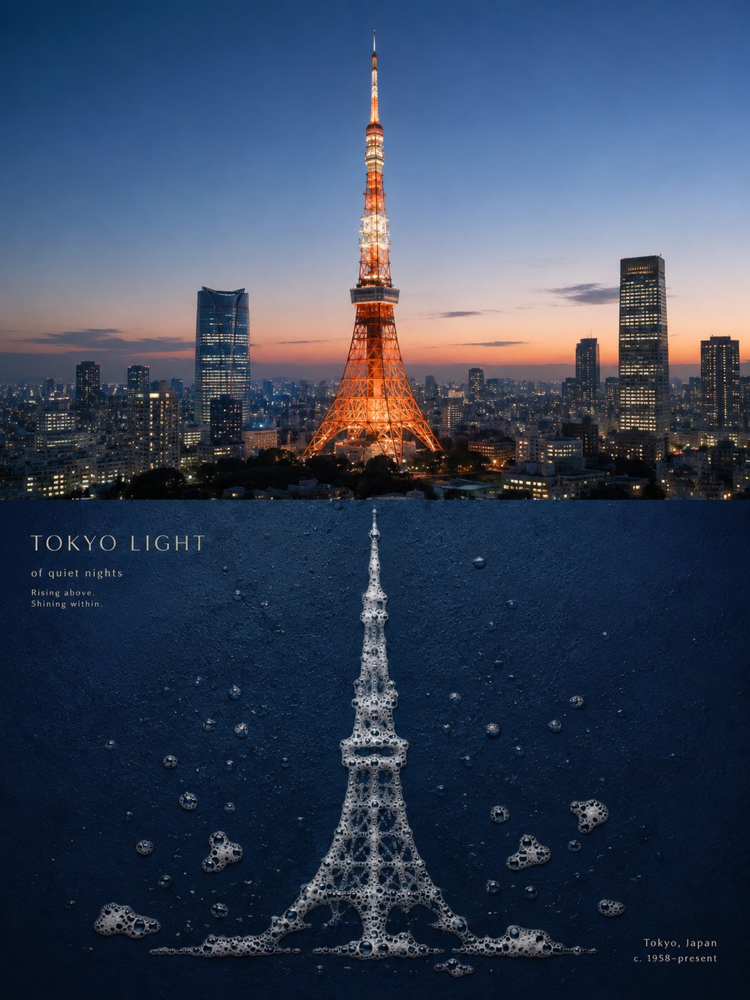
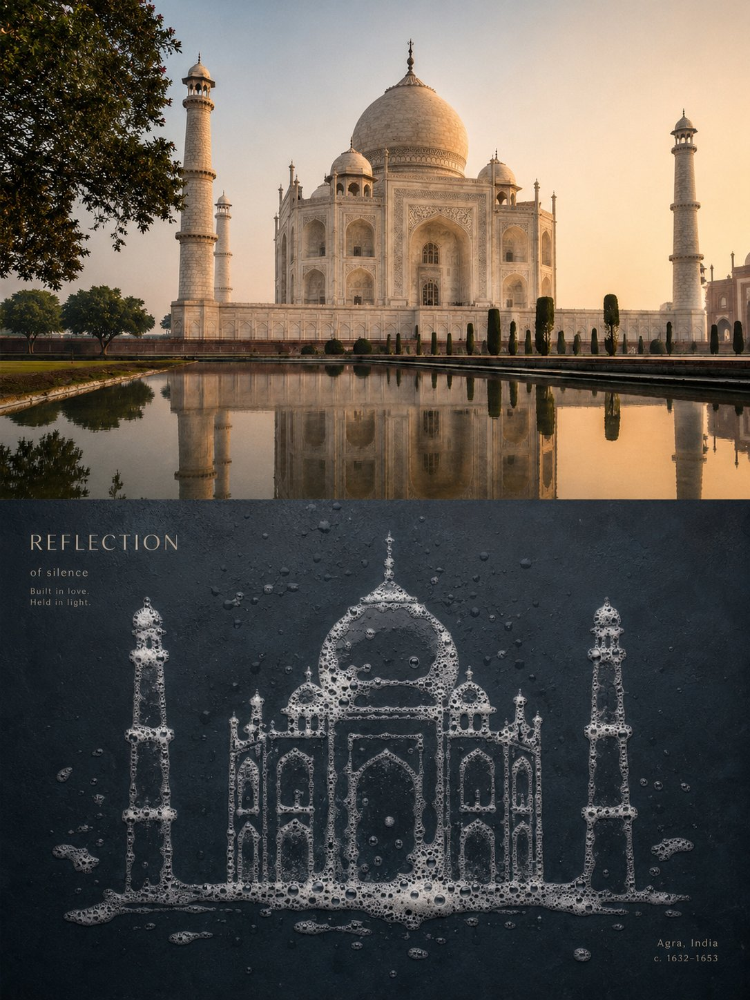
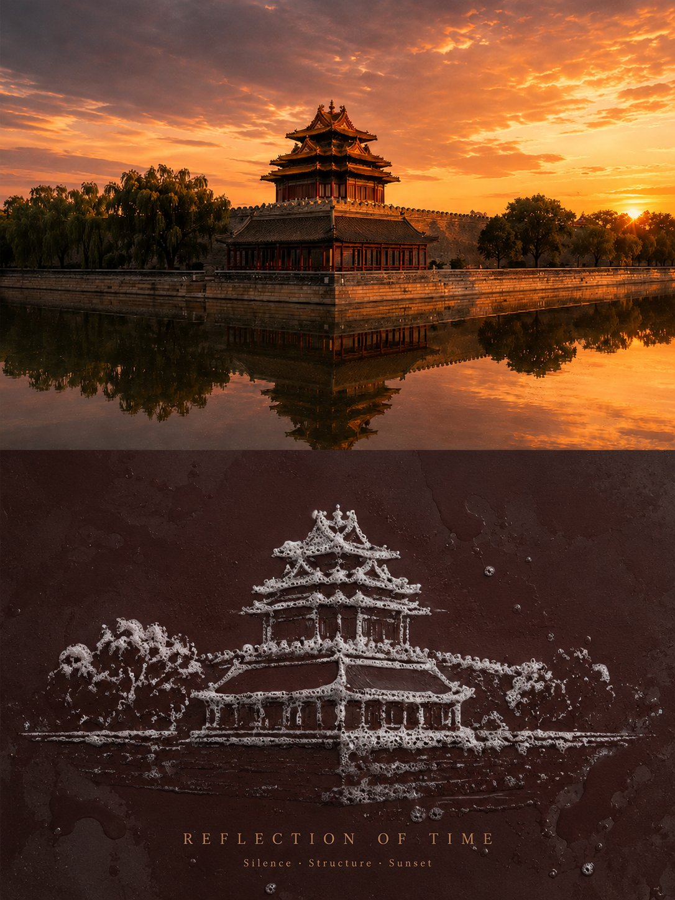

<p align="center"></p>

<div align="center">

# 🦁 XXD Panel 043

### 深い濡れた平面に、本物の泡で主体を描き直す

[](./SKILL.md)
[](#)
[](#)

<a href="README.md">简体中文</a> · <a href="README.en.md">English</a> · <strong>日本語</strong> · <a href="README.ko.md">한국어</a> · <a href="README.ar.md">العربية</a>

</div>

<div>

> 本物の泡 · 正面フラットレイ · 元写真由来の暗色地 · 微細気泡の縁 · 静かな空間

本物の白い泡、微細気泡、透明膜、濡れた縁、破泡の隙間、残液が、元写真に呼応する深い平面上で主体を直接形づくります。撮影は正面で透視歪みを持ちません。

## この Skill が必要な理由

このスタイルは元写真に依存し、内容を差し替えられる装飾プリセットではありません。変換は次の因果鎖に従います：

```text
lock decisive contour and action → preserve three cues → translate solid form into foam density, gaps, membranes, and residue → choose one source-related deep clean ground → photograph frontally with no perspective distortion → leave only a few scattered bubbles and wet traces → integrate copy as a mark already present on the plane
```

無関係な写真に替えても認識、構造、配置、素材、色、余白、文案が実質的に変わらないなら、本 Panel の成果ではありません。

## ビジュアル契約

- **元写真への拘束：** 深い濡れた平面に、本物の泡で主体を描き直す
- **スタイルDNA：** 本物の泡 · 正面フラットレイ · 元写真由来の暗色地 · 微細気泡の縁 · 静かな空間
- **識別性：** 元写真固有の手掛かりを三つ以上保ち、無関係な写真なら構造も実質的に変わること。
- **構図：** 一つの主体または不可分の関係、元写真に根拠のある配置、能動的な余白を守ること。
- **素材と色：** 固定テンプレートではなく、写真から導き、プロジェクト固有の生成仕様に従うこと。

完全な美的制約と拒否項目は Skill と生成プロンプトにあります。原文の美的動機を守りつつ、歴史的な3:4画布を隠れた既定値にはしません。 [SKILL.md](SKILL.md) · [production prompt](references/xxd-panel-043-prompt.en.md)

## 作例 · X より

> [小小東（@xiaoxiaodong01）](https://x.com/xiaoxiaodong01/status/2091148211050127565) · 2026年8月22日<br>
> GPT2 × 泡 × 再構成 × 美学プロンプト × VOL.043

<table>
  <tr>
    <td width="50%"><a href="https://x.com/xiaoxiaodong01/status/2091148211050127565"></a></td>
    <td width="50%"><a href="https://x.com/xiaoxiaodong01/status/2091148211050127565"></a></td>
  </tr>
  <tr>
    <td width="50%"><a href="https://x.com/xiaoxiaodong01/status/2091148211050127565"></a></td>
  </tr>
</table>

<p align="center"><a href="https://x.com/xiaoxiaodong01/status/2091148211050127565">元の投稿と完全なプロンプトを見る →</a></p>

これらの作例は 043 の美的意図を示すものであり、作例の被写体、構図、配色、コピー、旧キャンバス比率が生成時の参照や現在の既定値になることはありません。

## 組み合わせ可能な4つの出力

`1`、`1+3`、`1,2,4`、`全部` で一つまたは複数を選べます。`全部` は元画像ごとに7点の独立PNGを出力します。モード選択後、生成前に完成画像全体の画角を必ず確認します：元プロンプトの `3:4`、明示的な元画像比率、一般的な比率、またはカスタム比率／正確なピクセルです。元画像寸法を暗黙には適用しません。

| モード | 画角ルール | 成果物 |
| --- | --- | --- |
| `top-bottom` | ユーザー確認済みの完成画角 | 完成キャンバスを一度に生成：上に高忠実度の元画像、下に 043 デザイン、約50/50 |
| `left-right` | ユーザー確認済みの完成画角 | 完成キャンバスを一度に生成：左に高忠実度の元画像、右に 043 デザイン、約50/50 |
| `design-only` | ユーザー確認済みの完成画角 | 043 デザインが全画面を満たし、元画像は表示しない |
| `wallpaper-pack` | 端末ごとに確認 | スマートフォン、iPad、デスクトップ、子ども用ウォッチの個別PNG |

二連モードは元画像を高忠実度の編集／参照入力として使い、完全なスタイルプロンプト一式で完成画面を直接生成します。写真、デザイン、色、光、文字、意味を一体化するためです。決定論的な合成は、完成画面の再試行後も失敗した場合、原画像のピクセル完全保持を明示された場合、生成経路が指定画角に対応しない場合、または無劣化の最終ピクセル調整が必要な場合だけ使います。

壁紙は連動または独立を選べます。連動はiPad基準作を一つ承認し、他の端末を元画像＋同じ基準作から個別に再構成します。独立は各端末が元画像だけを参照します。どちらも他端末の成果を切り抜かず、派生を連鎖しません。

## 文案と言語

生成前に自動文案、正確な指定文案、文字なしを確定します。言語は指示文ではなく対象読者に従い、完成稿は一字一句保持します。

本プロジェクトの文案規則： 元写真の主体、動作、関係、感情、含意に強く結びつく短い題名を一つだけ作り、必要な微注記を最小限にします。対象言語固有の文字構造で画面の素材、輪郭、軸、余白へ統合し、完成稿は一字一句保持します。

## 完成キャンバス優先とラスター境界

画像モデルが完成画面全体の美的再構成を担当し、二連レイアウトも完成キャンバス一枚の直接生成を既定とします。`scripts/compose_panel.py` は条件付きの復旧、無劣化ピクセル調整、読み取り専用監査にだけ残し、毎回の事前計画や美的評価には使いません。

納品物はすべてPNGラスターで、呼び出しごとに `~/Desktop/xxd/` に新規タスクを作ります。設定済み画像経路は匿名化された状態だけを返し、提供元、接続先、認証情報、ヘッダー、プロンプト、応答、アカウント情報を公開しません。SVG、HTML、Canvas、図解、プログラム描画は最終作品の代替になりません。

## 使い始める

```bash
git clone https://github.com/nevertoday/xxd-panel-043.git
mkdir -p ~/.codex/skills
ln -s "$(pwd)/xxd-panel-043" ~/.codex/skills/xxd-panel-043
```

Claude Code では同じフォルダを次へリンクできます： `~/.claude/skills/xxd-panel-043`. インストール後に Agent セッションを再起動してください。

```text
$xxd-panel-043
Use this photograph, ask me for the modes and copy setting, then generate fresh raster outputs.
```

完全仕様: [Skill ワークフロー](SKILL.md) · [原始スタイル資料](references/043-source.md) · [英語生成プロンプト](references/xxd-panel-043-prompt.en.md) · [中国語生成プロンプト](references/xxd-panel-043-prompt.zh-CN.md)

## XXD について

XXD は Xiaoxiaodong のブランド名略称です。作成・管理： [@xiaoxiaodong01](https://x.com/xiaoxiaodong01).

## サポートとメンバーシップ

### 個別コンサルティング · 299元／時間

Skills の使用とワークフローに関する一対一の相談です。WeChat で Xiaoxiaodong にご連絡ください。 [WeChat](https://xiaoxiaodong.pages.dev/assets/wechat-qr.png)

### Xiaoxiaodong Skills ユーザー交流グループ · 99元

一回の支払いで Skills ユーザー交流グループに参加できます。時間制の個別相談は別料金です。

### Knowledge Planet＋会員プロンプトライブラリ · 699元／年

Knowledge Planet と会員プロンプトライブラリは一つの年会です。どちらかで加入後、WeChat で連絡するともう一方も開通できます。

[Knowledge Planet](https://wx.zsxq.com/group/15554814142882) · [Member Prompt Library](https://vip.xiaoxiaodong.ai/)

<p align="center"><a href="https://xiaoxiaodong.pages.dev/assets/wechat-qr.png"></a></p>

<div align="center"><strong>主体は泡が集まる場所に現れ、壊れ始める場所に残る。</strong></div>

---

<div align="center">

## ☕ オープンソースを支援

中国語圏以外では Buy Me a Coffee を利用できます。支援は任意で、オープンソースへのアクセスを変えません。


<p align="center"><a href="https://github.com/nevertoday/zhongguo-traditional-colors/blob/main/docs/images/buy-me-a-coffee-qr.png?raw=true"></a></p>

</div>
</div>
