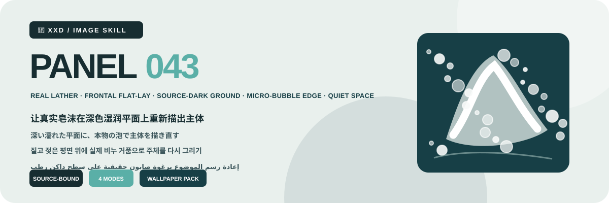

<p align="center"></p>

<div align="center">

# 🦁 XXD Panel 043

### 让真实皂沫在深色湿润平面上重新描出主体

[](./SKILL.md)
[](#)
[](#)

<strong>简体中文</strong> · <a href="README.en.md">English</a> · <a href="README.ja.md">日本語</a> · <a href="README.ko.md">한국어</a> · <a href="README.ar.md">العربية</a>

</div>

<div>

> 真实皂沫 · 正面平视 · 源图深底 · 细密泡缘 · 安静空间

主体由真实白色皂沫、细密气泡、透明泡膜、湿润边缘、破泡缺口和残留直接形成在与源图关联的深色平面上，并以正面无透视畸变摄影呈现。

## 为什么需要这套 Skill

这套风格依赖每一张源图，不是可替换内容的装饰预设。它遵循这条重构链：

```text
锁定决定性轮廓与动作 → 保留三个线索 → 用泡沫密度、缺口、泡膜与残留转译实体 → 选择一个与源图隐性关联的深净底色 → 正面无透视畸变拍摄 → 只留少量散泡与水痕 → 让文案像原本就存在于平面上的标记
```

如果换成无关照片后，辨识度、构造、位置、材质、颜色、留白与文案都不发生实质变化，结果就不属于这套 Panel。

## 视觉契约

- 从外轮廓、比例、姿态、方向、动作、开口或结构转折中保留至少三个源图专属线索。
- 使用真实白、乳白和半透明皂沫，包含大小变化的细密气泡、泡膜、湿边、破泡空洞、聚散、变薄与少量皂液残留。
- 采用完全正面、平视、平面摄影视角，水平垂直准确，无广角、倾斜、纵深夸张或边缘变形。
- 选择从源图色相与温度衍生或协调的深、净、低反射、略湿平整底面，保持克制而明确的明暗对比。
- 主体周围只允许少量散泡、水珠、接缝与湿痕，并保留大面积安静空间。

完整审美约束与拒绝项写在 Skill 和生产提示词中；它们保留原始提示词的审美动机，但不会把历史 3:4 画布变成隐藏默认值。 [SKILL.md](SKILL.md) · [production prompt](references/xxd-panel-043-prompt.en.md)

## 样张 · 即将补充

`assets/examples/` 只会放入项目作者确认过的本风格成品；未确认前不使用其他风格作为占位。

## 四种可组合输出模式

可以用 `1`、`1+3`、`1、2、4` 或 `全部` 选择一个或多个模式；`全部` 每张源图输出 7 张 PNG：三种普通模式各一张，外加四张壁纸。

| 模式 | 未指定尺寸 | 成果物 |
| --- | --- | --- |
| `top-bottom` | 源图自适应 `W×2H` | 上方完整源图＋下方变化设计，严格 50/50 |
| `left-right` | 源图自适应 `2W×H` | 左侧完整源图＋右侧变化设计，严格 50/50 |
| `design-only` | 源图自适应 `W×H` | 只显示变化设计，不出现原照片 |
| `wallpaper-pack` | 设备分别标注尺寸 | 手机、iPad、电脑、儿童手表四张独立 PNG |

壁纸可选连贯或独立。连贯套装先批准一张定调图，所有设备都共同参考原图与这同一锚点，绝不裁切或串联衍生图；独立套装每张只参考原图。

## 文案与语言

正式生成前确认自动文案、准确自定义文案或无文字；语言跟随目标受众而不是命令语言，用户给出的准确文案逐字保留。

本项目的文案规则： 使用一个极短主体、动作、情绪或隐喻标题，最多配两个状态词；目标语言文字沿轮廓、平面轴线、泡沫边缘或负形排列，可被泡沫局部遮挡，但必须可读且像存在于底面。

## 几何、位图与可信边界

普通模式未指定尺寸时按源图自适应；双联严格 50/50，全部交付为 PNG 位图。每次调用都在 `~/Desktop/xxd/` 下创建新任务，绝不泄露私密生成路线信息。

已配置的位图桥只输出脱敏状态，绝不暴露服务方、端点、凭据、请求头、提示词、响应或账户信息。SVG、HTML、Canvas、图表和程序绘图都不能代替最终位图作品。

## 开始使用

```bash
git clone https://github.com/nevertoday/xxd-panel-043.git
mkdir -p ~/.codex/skills
ln -s "$(pwd)/xxd-panel-043" ~/.codex/skills/xxd-panel-043
```

Claude Code 用户可把同一文件夹链接到 `~/.claude/skills/xxd-panel-043`. 安装后请重启 Agent 会话。

```text
$xxd-panel-043
Use this photograph, ask me for the modes and copy setting, then generate fresh raster outputs.
```

完整规格: [Skill 工作流](SKILL.md) · [原始风格档案](references/043-source.md) · [英文生产提示词](references/xxd-panel-043-prompt.en.md) · [中文生产提示词](references/xxd-panel-043-prompt.zh-CN.md)

## 关于 XXD

XXD 是小小东品牌名的缩写，本项目由小小东创建并维护： [@xiaoxiaodong01](https://x.com/xiaoxiaodong01).

## 支持与会员

### 深度咨询 · 299 元／小时

一对一深入咨询 Skills 的使用与工作流，通过微信联系小小东预约。 [WeChat](https://xiaoxiaodong.pages.dev/assets/wechat-qr.png)

### 小小东 Skills 用户交流群 · 99 元

一次付费加入 Skills 用户交流群，用于工作流分享和用户间讨论；不包含按小时计费的一对一咨询。

### 知识星球＋成员提示词库 · 699 元／年

知识星球和成员提示词库是一份会员费用：从任一入口开通后，通过微信联系小小东获取另一边的权益。

[Knowledge Planet](https://wx.zsxq.com/group/15554814142882) · [Member Prompt Library](https://vip.xiaoxiaodong.ai/)

<p align="center"><a href="https://xiaoxiaodong.pages.dev/assets/wechat-qr.png"></a></p>

<div align="center"><strong>主体在泡沫聚集处出现，也在破裂开始处留下。</strong></div>

---

<div align="center">

## ☕ 支持这个开源项目

算力赞助请使用小小东自己的微信或支付宝赞赏码；赞助完全自愿，不改变开源项目的访问权限。


<table><tr>
<td align="center"><a href="https://colors.xiaoxiaodong.ai/docs/images/wechat-reward-qr.png"></a><br><strong>WeChat</strong></td>
<td align="center"><a href="https://colors.xiaoxiaodong.ai/docs/images/alipay-reward-qr.png"></a><br><strong>Alipay</strong></td>
</tr></table>

</div>
</div>
